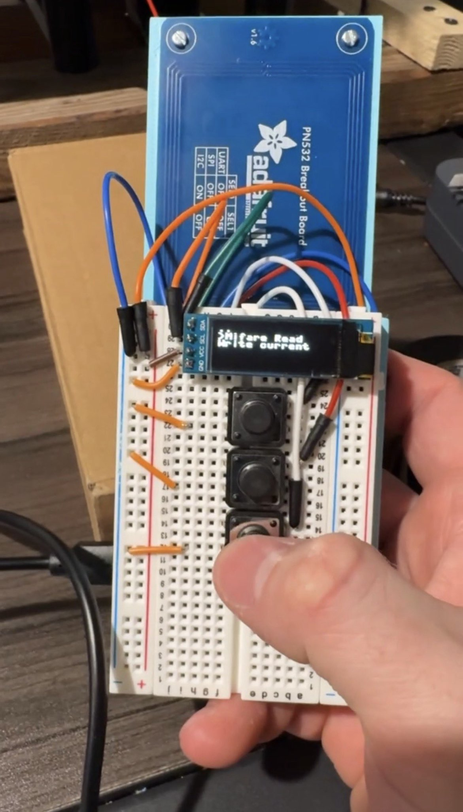
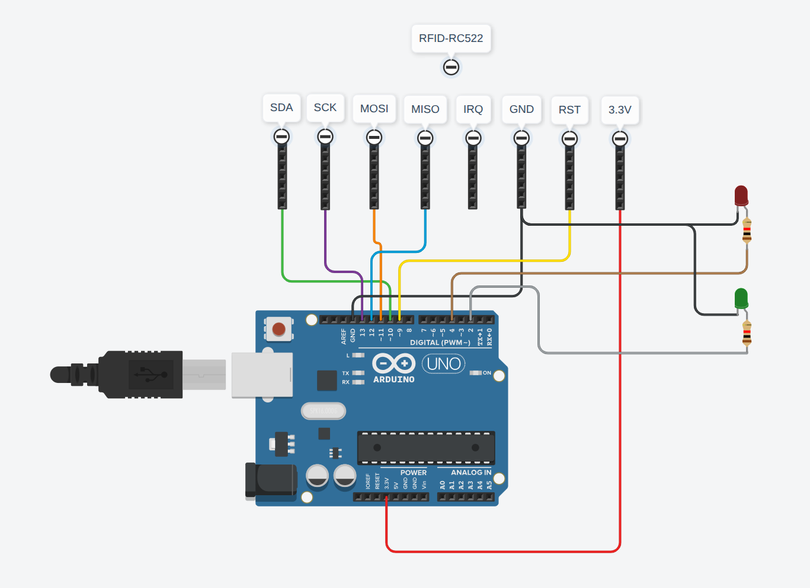

# Project Overview

**Introduction**

This project aims to use a typical PN532 to skim the UID off of a MiFare/NFC keycard to be able to gain access to whatever place the keycard unlocked. Many commercial locks only use the UID of the keycard to be unlocked.

The standard PN532 is widely available and cheap. Manufacturers prevent custom UIDs from being emulated because so many locks only read the UID. When the 532 is put into target mode, the first byte of the UID will always be 0x08 (or 0x88 with some models). While there are ways to get around this security feature, it is difficult to implement in an embedded system, unreliable, and requires perfect timing (read more about it [here](https://www.mankier.com/1/nfc-emulate-uid)). The other solution is trivially easy to implement. Rather than go with the true emulation method, we picked up a [lab401 sector 0 programmable card](https://lab401.com/collections/all-products/products/mifare-compatible-1k-direct-write-uid). This method absolves adafruit of all legal liability, which is exactly the reason that firmware feature implementing a hardware protocol requirement (prepending a 0x08 byte) exists. Conveniently, this makes our design more discreet. 

 

**Challenges and Solutions**

- We wanted a controlled environment to test our project's functionality and so that's what we did. We made an RFID lock with an arduino uno and MFRC-522 module (code found [here](RFID_lock/RFID_lock.ino)). The lock came with it's own problems. It took a while to find out what was going on, but we weren't getting any response from our MFRC-522 because it wasn't an official module. We needed to slow down communication to our module and connect it to 5V even though 3.3V was printed on the PCB. *Note: we labeled it 3.3V-3.3V in the wiring diagram*
- The original idea for this project was to have the PN532 emulate the copied UID itself. Unfortunately, due to security concerns (😒) the PN532 prepends a 0x08 byte when it sends its UID. So calling the command to send a specified UID like: 0x0000BEEF, would send: 0x080000BE. Luckily, you can just write a non-modified UID to a card. So this is what we ended up pivoting to as you read above.
- We needed this project to be able to save multiple UIDs while also maintaining its embeddedness. We solved this problem with a little OLED screen and added logic to (save/load) UIDs (to/from) a .json file. The screen uses I2C and can display 3 lines of options at a time, selectable with 3 buttons (up/down/select).

**Timeline**

- Test lock finished (9/26/25)
- Basic read functions implemented on PN532 (10/7/25)
- Emulating function implemented, it is discovered that an 0x08 is prepended to every emulation (10/16/25)
- Writing function finished (10/23/25)
- Functional prototype finished (10/27/25)
- Rev1 finsihed with screen displaying selectable UIDs to write. UIDs saved in memory (11/11/25)
- NFC compatibility added (11/20/25)

**Testing and Results**

| Card copied | UID | Test lock opened? |
|:------------|:---:|:------------:|
| MiFare Classic | F889A452 | ✅ |
| MiFare Classic | 14BD09C7 | ✅ |
| MiFare Classic | 5EC4A4BE | ✅ |
| Credit Card | 903F4BD2 | ❌ |
| Credit Card | A660CD4F | ❌ |
| NTAG | 28B05EA8 | ✅ |
| NTAG | ED7B30A1 | ✅ |

In both tests with our credit cards, the cloner was not able to read their UID, though the lock was.

# Project Capabilities

This device is capable of reading both MiFare classic and NTAG card UIDs, saving them, and writing them to a card whose UID is reprogrammable. The device can have as many UIDs as the memory for the RPI Pico will allow - in theory. This device cannot copy credit cards even though early tests suggested otherwise. (Credit cards often use different RFID communication protocols, are EMV compliant, DESFire cards, or different chip architectures entirely. Credit card data is organized differently as well. Most importantly, even if we could read the card data reliably, it wouldn't tell us anything about the transaction mechanism because everything is cryptographically protected.)

# Hardware Components

 - Raspberry Pi Pico 2 W
 - Adafruit PN532
 - *Arduino UNO
 - *RFID-MFRC522 module

*Necessary for RFID test lock

# Software Dependencies

 - [micropython .UF2 for pi pico 2 W](https://www.raspberrypi.com/documentation/microcontrollers/micropython.html)
 - [NFC PN532 SPI library](https://github.com/Carglglz/NFC_PN532_SPI?tab=readme-ov-file)
 - *[MFRC library](https://docs.arduino.cc/libraries/mfrc522)

*Necessary for RFID test lock

# Implementation

**Wiring Diagrams and Information**

*Emulator*
*Diagram Here*

| RPI Pico 2 W | Adafruit PN532 Breakout |
|:-------------|:------------------------|
| 3V3 (3.3V) | Vcc / 3.3V |
| GND | GND |
| GP16 (SPI0 MISO) | MISO (SSO / SO) |
| GP17 (CS / CHIP_SELECT | SS (active low) |
| GP18 (SPI0 SCK) | SCK |
| GP19 (SPI0 MOSI) | MOSI (SDA) |
| (optional) GP15 | IRQ |
| (optional) GP20 | RSTO / RST |

*RFID Lock*

| Arduino Uno | MFRC-522 |
|:----|:----|
| 3.3V | 3.3V |
| GND | GND |
| D9 | RST |
| D10 | SDA |
| D11 | MOSI |
| D12 | MISO |
| D13 | SCK |
| N/A | IRQ |

We also used two indicator LEDs on D2 and D4 so we didn't have to look at the terminal everytime to see if access was granted / denied. 

## CAD Files

We used a few prints to bring this project together and give it a more prolished look. You can find them [here](CAD_files/)

# Acknowledgements
We used Carglglz's [driver](https://github.com/Carglglz/NFC_PN532_SPI) to control the basic functions of the PN532, such as initialization and reading mifare classics.

We added functionality to that driver using the principles from the [Adafruit PN532 driver](https://github.com/adafruit/Adafruit-PN532/blob/master/Adafruit_PN532.cpp) to write data to a programmable card, following mifare classic protocol. 
